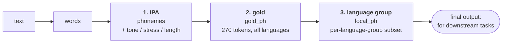

# Standard G2P

Multilingual text → **standardized phoneme labels**, one label set per language group, for downstream speech tasks.

This is a fork of [CharsiuG2P](https://github.com/lingjzhu/CharsiuG2P) (Zhu, Zhang & Jurgens, 2022). The upstream
ByT5 model converts a word in any of 100 languages into an IPA string. That string is not usable as a training label:
the same sound is spelled several ways, tone and stress are mixed into the letters, and every language has its own
symbol set. This fork adds `standard_g2p/`, which turns the IPA strings into labels in three stages.

## The three stages



| stage | what it is | output key | label space | where it lives |
|---|---|---|---|---|
| **1. IPA** | The model's IPA for each word, cleaned up (encoding artifacts fixed) and split into phonemes. Tone, stress and length are split off into parallel layers. | `phonemes`, `tone`, `stress`, `length` | open-ended IPA strings | `gold_g2p.py` |
| **2. gold** | Each phoneme mapped onto one closed inventory of 270 tokens shared by all 100 languages. Rare phonemes back off to a close neighbour (`ɓ` → `b`). | `gold_ph` | 270 (`n_gold_ph`) | `phoneme_inventory_gold.py` |
| **3. language group** | The gold tokens re-indexed into the smaller list of the language's **language group**. This is the **final output**: downstream tasks are expected to use these local tokens. | `local_ph` | per language group (`n_local_ph`) | `lang_group_inventory.py` |

Downstream tasks are expected to use the **local tokens of the language group** (`local_ph`), not gold indices and
not raw IPA. Every language belongs to exactly one language group (`lang_codes.lang_group(lang)`). Languages are
grouped by writing system, word segmentation and tone:

| lang_group | tokens | languages (BCP 47) |
|---|---:|---|
| `latin` | 213 | af ang arg az bs ca cs cy cy-sw da de egy en en-GB enm eo es es-419 es-MX et eu fi fr fr-CA ga gl hu ia id io is it la la-eccl lb lt mi ms mt nb nl pap pl pt pt-BR ro se sk sl sq sv sw tk tl tr uz vi vi-c vi-s |
| `cyrillic` | 128 | ady ba be bg hbs hbs-Cyrl kk mk ru sr tt uk |
| `other_alphabetic` | 107 | am el grc hy hy-west ka ko |
| `abjad` | 91 | ar fa ku sd syc ug ur |
| `brahmic` | 98 | hi or sa ta |
| `cjk` | 48 | yue zh zh-Hant nan\* |
| `thai_khmer` | 47 | km th tts\* |
| `japanese` | 28 | ja |
| `burmese` | 4 | my\* |

`tokens` includes the 4 special tokens `<blank>`, `SIL`, `noise`, `<unk>`, which are the same in every language
group (see *Special tokens* below). \* excluded for now (`lang_codes.EXCLUDED_ISO`, see *Excluded languages*
below). Excluded languages did not shape their language group's token list, so `burmese` has only the special
tokens. `hbs` is in `cyrillic` although `hbs` itself defaults to Latin script (see `lang_codes.py`).

Why the gold stage exists if downstream tasks use the local tokens: `.gs.json` files **store gold indices**, and
`to_local()` converts them to local indices **when they are read**. So the language group lists can be regenerated
without rewriting a corpus, and a gold index names the same phoneme in every language group, which lets them be
compared. The tone, stress and length layers use one small scale shared by every language (for example 22 tone
values), so they have no language group stage. Every index comes with the size of the space it belongs to (`n_*`
keys).

---

## Quick start

One sentence through all three stages:

```python
from standard_g2p.gold_g2p import goldG2P
from standard_g2p import lang_group_inventory as LGI

G = goldG2P(device='cuda:0')        # weights are fetched once into tmp/
d = G.phonemize_sentence('uma parceria', lang='pt-BR')        # stages 1 and 2
t = LGI.to_local(d['gold_ph'], 'pt-BR')                       # stage 3
```

Stages 1 and 2, from `phonemize_sentence`:

```python
{'lang': 'pt-BR', 'g2p_lang': 'por-bz',
 'n_tones': 22, 'n_stresses': 3, 'n_lengths': 3, 'n_gold_ph': 270, 'n_gold_phg': 15,   # scope
 'words':    ['uma', 'parceria'],
 'ipa':      ['ũɐ', 'paʁseɾiɐ'],                                     # raw model output, for audit
 # stage 1: IPA
 'phonemes': ['ũ', 'ɐ', 'p', 'a', 'ʁ', 's', 'e', 'ɾ', 'i', 'ɐ'],    # standardized IPA segments
 'tone':     [0, 0, 0, 0, 0, 0, 0, 0, 0, 0],                         # < n_tones
 'stress':   [0, 0, 0, 0, 0, 0, 0, 0, 0, 0],                         # < n_stresses
 'length':   [0, 0, 0, 0, 0, 0, 0, 0, 0, 0],                         # < n_lengths
 'word_num': [0, 0, 1, 1, 1, 1, 1, 1, 1, 1],
 # stage 2: gold
 'gold_ph':  [204, 38, 23, 4, 37, 5, 7, 18, 6, 38],                  # < n_gold_ph
 'gold_phg': [1, 2, 4, 3, 8, 7, 2, 11, 1, 2],                        # < n_gold_phg (phoneme group, optional coarse target)
 'gold_unmapped': []}
```

Stage 3, from `to_local`. These are the final output, the local tokens of the `latin` language group:

```python
{'lang': 'pt-BR', 'lang_group': 'latin',
 'local_ph': [177, 38, 23, 4, 37, 5, 7, 18, 6, 38],   # < n_local_ph
 'n_local_ph': 213, 'n_gold_ph': 270,
 'unk': 3, 'n_folded': 0, 'gold_fingerprint': '9438371ed6dd'}
```

The same `ũ` is 204 in gold and 177 in `latin`. `LGI.decode(t['local_ph'], 'pt-BR')` turns the local indices back
into `['ũ', 'ɐ', 'p', …]`. A gold token that is not on the language group's list becomes its `<unk>`, and `n_folded`
counts how many did.

`local_ph` is not always the same length as `phonemes`. A phoneme that backs off can expand to several gold tokens
(`ʈ͡ʂ` → `ʈ ʂ`), and the tone, stress and length layers stay aligned with `phonemes` (see §4 below).

### Examples

| script | model? | shows |
|---|---|---|
| [examples/01_phonemize_sentence.py](examples/01_phonemize_sentence.py) | yes | sentence → layers → local language-group tokens, across 7 languages |
| [examples/02_ipa_layers.py](examples/02_ipa_layers.py) | no | how raw IPA is normalized, segmented and split into layers |
| [examples/03_inventories.py](examples/03_inventories.py) | no | label-space sizes, the gold inventory, the language group tables |
| [examples/04_features.py](examples/04_features.py) | no | articulatory features, an optional auxiliary target |
| [examples/05_phonemize_srt.py](examples/05_phonemize_srt.py) | yes | transcript JSON in, `.gs.json` out |
| [examples/06_word_segmentation.py](examples/06_word_segmentation.py) | yes | th/km/my/ja/zh/yue: text → words → IPA with tone |

Requirements: `torch`, `transformers`, `huggingface_hub` for inference, plus a segmenter for each unspaced
language you use (see the table under *Know before you trust the output*). The tables
(`lang_codes`, `lang_group_inventory`, `phoneme_inventory_gold`, `phoneme_features`) and `word_segmentation.split_words`
need only the standard library, so a training data loader can import them without pulling in `transformers`.

---

## How the standardization works

The detail behind the three stages. §1–3 are stage 1 (IPA), §4 is stage 2 (gold), and §5 is stage 3 (language
group).

The model returns one IPA **string** per word. Four problems stand between that string and a training label. Each
one corrupts the labels silently if it is left alone.

### 1. Normalization: the training data is not uniformly IPA

CharsiuG2P was trained on dictionaries scraped largely from Wiktionary. About 5% of the tokens are transcription
artifacts, and the model reproduces them at inference. `normalize_ipa()` repairs them before anything is counted:

| artifact | where | example | becomes |
|---|---|---|---|
| SAMPA instead of IPA | `swe` (all of it) | `plA:na%vE:gen` | `plɑːnaˌvɛːɡen` |
| SAMPA capitals | `uzb`, `ger`, `swa` | `t͡S` | `t͡ʃ` |
| Chao tone digits | `nan` | `kʰuan²¹⁻⁵³` | tone layer `21` |
| optional-palatalization parens | `rus` | `⁽ʲ⁾` | `ʲ` |
| codepoint duplicates | everywhere | `:` `g` `ʧ` | `ː` `ɡ` `t͡ʃ` |
| Greek look-alikes | `fra-qu`, `grc` | `ε` | `ɛ` |
| above/below diacritic variants | | `ŋ̊` / `n̥` | one spelling |
| doubled modifiers | `ara` | `tˤˤ` | `tˤ` |

### 2. Segmentation: an IPA string is not a list of phonemes

One phoneme can span several codepoints: `t͡ʃ` (tie bar), `pʰ` (modifier letter), `ẽ` (combining mark), `aː` (length
mark). `segment_ipa()` groups codepoints by Unicode category, so each of these stays one segment.

### 3. Layers: tone, stress and length are not phonemes

These belong to the syllable, not the segment. Folding them into the phoneme label multiplies the inventory (`a`,
`aː`, `a˧`, `aː˥˩` would each be a class) and puts tonal languages in a label space of their own. `decompose_ipa()`
splits them into parallel arrays of the same length:

```python
>>> decompose_ipa('pʰaː˧.saː˩˩˦', lang='tha')
{'segments': ['pʰ', 'a', 's', 'a'],
 'length':   [ 0,    2,   0,   2 ],      # 0 short / 1 half-long / 2 long
 'tone':     ['',   '˧',  '', '˩˩˦'],    # on the nucleus; -> TONE_VOCAB index
 'stress':   [ 0,    0,   0,   0 ]}      # 0 none / 1 primary / 2 secondary
```

Tone contours from all scripts are unified into Chao numerals (`˧˥` and `³⁵` both become `35`) and indexed into
`TONE_VOCAB` (22 values, 0 = no tone). This way Mandarin, Thai and Cantonese share their segment classes with English
and Arabic. Cantonese alone has 31 segments and 23 tone contours: merged, that would be hundreds of classes; as
layers it is 31 + 23.

### 4. The gold inventory: one closed label set for all languages

[standard_g2p/phoneme_inventory_gold.py](standard_g2p/phoneme_inventory_gold.py) is built from the whole CharsiuG2P
training corpus (7.7M pronunciations, 100 languages). A segment is admitted if it is attested in **at least 2
languages**. A phoneme seen in only one language has no cross-lingual evidence, so the model would just memorize
that language's data.

| admission criterion | segments | token coverage |
|---|---:|---:|
| everything | 676 | 100% |
| **≥ 2 languages** | **266** | **99.47%** |
| ≥ 3 languages | 207 | 98.81% |
| ≥ 5 languages | 154 | 98.20% |

Token layout: the 4 special tokens `<blank>`, `SIL`, `noise`, `<unk>` (indices 0–3, see *Special tokens* below),
then the 266 phonemes by frequency, **270 tokens** in total. A segment outside the inventory is rewritten by
`BACKOFF` (387 entries). In order, it tries to: peel off fine
diacritics → reduce to the bare base → split a tie-bar unit → apply a manual table (implosives `ɓ → b`) → route junk
to `noise`. With backoff, coverage is 100%. Anything that still has no mapping becomes `<unk>` and is listed in
`gold_unmapped`.

`gold_ph` is **not** index-aligned with `phonemes`, because a backed-off segment can expand into several units
(`ʈ͡ʂ → ʈ ʂ`).

**Phoneme groups and features.** `gold_phg` gives each gold token one of 15 phoneme groups (vowel_close, stop_voiced,
nasal, …), an optional coarse target next to the fine one.
[standard_g2p/phoneme_features.py](standard_g2p/phoneme_features.py) gives every token 20 articulatory features
(taken from [panphon](https://github.com/dmort27/panphon) and stored in the repo, so panphon is not needed at run
time). `feature_targets()` returns binary targets plus a mask. The mask covers features that don't apply (`distr` on a
vowel) and special tokens, so no loss is taken there.

### 5. Language groups: the final label sets

Each language belongs to one language group, defined by writing system, word segmentation and tone. Language groups
do not follow language family. Grouping by family was measured and rejected, because phoneme inventories do not
recover families (see [standard_g2p/mappings/lang_stats.md](standard_g2p/mappings/lang_stats.md) §4).

Each language group's token list is a **subset** of the 270 gold tokens. For every member language, and for each of
two sources (the model's actual FLEURS output and the training dictionaries), the most frequent gold phonemes are
kept until 99.9% of that language's tokens are covered. The language group's list is the union of these. Every
language therefore keeps ≥ 99.9% of its tokens, and a phoneme that one small language needs is not voted out by a
large one. The resulting sizes are in the table under *The three stages*.

The special tokens keep their gold indices in every language group (blank = 0 everywhere). A gold token outside a
language group's list becomes its `<unk>`, and `to_local()` reports how many did so as `n_folded`. Stored files keep
only gold indices and are converted at load time. That way the language group lists can be regenerated without
rewriting a corpus. `LGI.load()` raises `StaleInventoryError` if the table was built against a different gold
inventory.

### Special tokens: `<blank>`, `SIL`, `noise`, `<unk>`

Every label space starts with the same four tokens, at the same indices in gold and in every language group:

| index | token | produced by | meaning |
|---:|---|---|---|
| 0 | `<blank>` | never produced here | Reserved for CTC, which needs a blank at index 0. |
| 1 | `SIL` | `phonemize_srt` only, from the segment's `trim` | Silence at the start or end of a clip (details below). |
| 2 | `noise` | `BACKOFF`, for junk in the model's IPA | The model emitted something that is not a phone (details below). |
| 3 | `<unk>` | gold mapping, or `to_local` | A phoneme with no label in this space (details below). |

**`SIL`.** A transcript segment can carry `trim: [leading, trailing]`, the silence at each end in seconds. If the
leading silence is over 0.25 s, `phonemize_srt` inserts `SIL` before the first phoneme; if the trailing silence is
over 0.30 s, it appends one after the last. Its tone, stress and length are 0, and its `word_num` is that of the
first or last word. Otherwise edge silence would be labelled with whatever phoneme sits at the edge. `SIL` is
never inserted inside a segment or between words, and never by `phonemize_words` / `phonemize_sentence`, which
have no timing. `sil_from_trim=False` turns it off.

**`noise`.** This is not acoustic noise: nothing in this repo looks at audio. It is where 20 `BACKOFF` entries send
characters the model sometimes emits that are not phones: digits (`0 1 2`), punctuation (`? ! _ …`), control and
replacement characters, stray kana (`ッ っ ヶ ゎ ヮ`), and Arabic letters copied from the input (`ش و ه ر ة`). The
label keeps its length, but the junk is marked as junk rather than mapped onto a real phoneme.

**`<unk>`** comes from two places:
- **Gold:** a segment with neither an inventory entry nor a `BACKOFF` rule becomes `<unk>` and is listed in
  `gold_unmapped`. `goldG2P.print_stats()` tallies these across a run.
- **Language group:** a gold token that is not on the language group's list becomes its `<unk>`, counted in
  `n_folded`. For an excluded language this can be every token (see `burmese` above).

### Scope: every index carries its range

| key | indexes | size |
|---|---|---|
| `tone` | `gold_g2p.TONE_VOCAB` | `n_tones` = 22 |
| `stress` | none / primary / secondary | `n_stresses` = 3 |
| `length` | short / half-long / long | `n_lengths` = 3 |
| `gold_ph` | `phoneme_inventory_gold.TOKENS` | `n_gold_ph` = 270 |
| `gold_phg` | `phoneme_features.GROUP_NAMES` | `n_gold_phg` = 15 |
| `local_ph` (from `to_local`) | `lang_group_inventory.tokens(lang_group)` | `n_local_ph` (per language group) |

The same scope keys appear in `phonemize_words` / `phonemize_sentence` output and in the header of every `.gs.json`
written by `phonemize_srt`.

---

## Language codes

`lang` is always a single **BCP 47** code: ISO 639-1 where the language has one (`en`, `zh`), otherwise ISO 639-3
(`ckb`, `hbs`). A suffix selects a non-default variant (`pt-BR`, `es-419`, `zh-Hant`, `en-GB`). CharsiuG2P's own tags
(`eng-us`, `ger`, `por-bz`) are internal and never valid as `lang`.

```python
from standard_g2p.lang_codes import bcp47_to_tag, tag_to_bcp47, lang_group
bcp47_to_tag('pt-BR')     # 'por-bz'
bcp47_to_tag('pt')        # 'por-po'  -- a bare code picks the default variant
tag_to_bcp47('eng-uk')    # 'en-GB'
lang_group('cmn')         # 'cjk'
```

A bare code resolves to its default variant: `pt` → European Portuguese, where *parceria* is `pɐɾsɨɾiɐ` rather than
`paʁseɾiɐ`. Nothing errors, so pass the regional code whenever it matters. `bcp47_to_tag` **raises** on an unknown
language instead of falling back. ByT5 reads bytes, so an invented tag still produces IPA-shaped output for some
other language, and nothing downstream could tell.

---

## Know before you trust the output

- **G2P gives dictionary pronunciations, not what was said.** Reduction, coarticulation and dialect make real speech
  differ systematically from these labels.
- **The model reproduces its training dictionary, including casual variants.** For example, `dicts/por-bz.tsv` lists
  both `umɐ` and `ũɐ` for *uma*, and the model returns the casual form `ũɐ` with the /m/ dropped. The model also
  under-predicts rare phonemes, because it drifts toward frequent symbols.
- **Eight languages need word segmentation**: `zh`, `yue`, `nan`, `ja`, `th`, `tts`, `km`, `my`. This is a *word*
  model, and in these scripts `split_words` hands it whole clauses. `word_segmentation.segment(text, lang)` splits
  them into words where a segmenter exists, and `phonemize_sentence` / `phonemize_srt` use it. Space-delimited
  languages go through `split_words` exactly as before.

  | lang | segmenter | install |
  |---|---|---|
  | `th` | pythainlp `newmm`, plus repairs for cuts inside a syllable and for `ๆ` | `pythainlp` |
  | `km` | khmer-nltk, plus `ៗ` expansion | `khmer-nltk` |
  | `my` | pyidaungsu | `pyidaungsu` |
  | `ja` | fugashi with UniDic-lite. **The model gets UniDic's katakana reading, not the text**, so `words` is katakana | `fugashi unidic-lite` |
  | `zh`, `zh-Hant` | longest match on the model's own `dicts/zho-{s,t}.tsv` | none |
  | `yue` | pycantonese | `pycantonese` |

  Each backend was chosen by running the model on real sentences, not by counting how many segmented words are
  dictionary entries. That count favours cutting words into dictionary pieces, and for Thai, Khmer and Burmese those
  pieces are read differently: loanwords turn into letter names, linking vowels are dropped, and Burmese loses the
  consonant voicing across word boundaries. The measurements are in
  [word_segmentation.py](standard_g2p/word_segmentation.py). Some highlights:
  - **Thai** (439 FLEURS dev clips): the old split gave 4.1 "words" per clip, averaging 29 characters. At
    `max_length=64` the model's IPA stopped partway through each one, so the rest of the clause got no labels at
    all. Now there are 24.2 words per clip, and 93.2% of vowels carry a tone.
  - **Japanese:** the reading fixes the particles `は` → `wa` and `へ` → `e` (from the text the model says `ha`,
    `he`), and it fixes readings that depend on context (`昨日` → `kinoː`, `雨` → `ame`). UniDic-lite does read `日本`
    as `nipːoɴ`.
  - **Mandarin:** per-character input reads `音乐` with the `快乐` reading and loses the neutral tone of `们`. The
    longest match does not have either problem.
  - In zh, yue and th every word carries a tone. The vowels without one are the first half of a diphthong; the
    tone goes on the second half.
  - **Not segmented**: `nan` and `tts` (both in `EXCLUDED_ISO`). `has_segmenter(lang)` is False for them, and
    `g2p_task.task_g2p_phonemize` skips them by default.
  - `phonemize_srt` does not use Whisper's `words` directly for these scripts. Whisper's words there are tokenizer
    pieces, so it joins them and segments the joined text. `words` in the output is the segmented list, and
    `word_num` indexes it.
- **Numerals are not verbalized.** `1979` goes to the model as one "word" in every language, and in Thai it comes back
  with no tone.
- **Excluded languages** (`lang_codes.EXCLUDED_ISO`): `my` (its tone is written as vowel diacritics, so it never
  reaches the tone layer), `nan` (no segmenter, sandhi), and `tts` (its dictionary is a romanization, not IPA). They
  keep their language group but did not shape its token list. `my` is the only member of `burmese`, so that language group's list holds
  only the 4 special tokens and `to_local` turns every Burmese phoneme into `<unk>`. Burmese is segmented now, but
  its labels are unusable until it is taken off the list and `create_phoneme_inventories.py` is rerun.
- **Stress is transcribed for only about a third of the languages.** 34 of the 100 dictionaries (`dicts/`) carry
  stress marks, 33 of them on at least 1% of entries. A missing stress mark means "not annotated", not
  "unstressed", so mask the stress loss for the other languages.
- **Pitch accent is not tone.** `hbs`, `slv`, `san` and `grc` use the same acute and grave marks for pitch accent, and
  `kur` uses them for stress. `tone_diacritics=True` would misread all of these as tone.
- **Homographs** (English *read*, *lead*) get a single pronunciation, because the model sees no context.

### Upgrading older `.gs.json` files

- Header keys were renamed to match the in-memory output: `n_tokens` → `n_gold_ph`, `n_groups` → `n_gold_phg`,
  `n_stress` → `n_stresses`.
- Labels for Brahmic, Thai, Khmer and Burmese scripts written before 2026-09-23 are corrupt and must be regenerated.
  `split_words` used to treat vowel signs and viramas as word separators.
- Labels for th, km, my, ja, zh and yue written before 2026-09-24 were phonemized clause by clause (see above) and
  must be regenerated. Burmese `၏ ၍ ၌ ၎` used to be dropped as punctuation.

---

## Repository layout

```
standard_g2p/                   the module
  gold_g2p.py                   goldG2P model wrapper, IPA normalization/segmentation, layers, file I/O
  lang_codes.py                 BCP 47 <-> CharsiuG2P tag, tone/segmentation flags, language groups (no deps)
  word_segmentation.py          text -> words: split_words, and segmenters for unspaced scripts
  phoneme_inventory_gold.py     the 270-token gold inventory + BACKOFF          (generated)
  phoneme_features.py           20 articulatory features + 15 phoneme groups    (generated)
  lang_group_inventory.py       gold indices -> local indices per language group, the final output (no deps)
  mappings/
    lang_group_inventories.json per-language-group token lists, loaded at run time (generated)
    phoneme_counts.md           mapping health, backoff/unmapped report, language group lists
    lang_stats.md               the measurements behind lang_codes.py's groupings
    *.json                      the raw counts behind the two reports
scripts/                        generators for everything marked (generated)
examples/                       runnable examples
g2p_task.py                     batch-phonemize a paths_list of transcripts to .gs.json

dicts/  data/  sources/  notebooks/  multilingual_results/      inherited from CharsiuG2P
charsiug2p_original_src/        CharsiuG2P's original training/evaluation code
```

### Regenerating the tables

Everything marked *(generated)* comes from a script. Hand edits are lost at the next regeneration.

```bash
python scripts/layers.py                   # 1. enumerate every segment in data/train/  -> tmp/inventory_build/
python scripts/build_inventory.py          # 2. -> standard_g2p/phoneme_inventory_gold.py
python scripts/build_features.py           # 3. -> standard_g2p/phoneme_features.py (needs panphon)
python scripts/measure_lang_groups.py      # -> mappings/lang_stats.{json,md} (needs scipy)
python scripts/create_phoneme_inventories.py [--paths <fleurs paths_list> --metadata-dir <dir>]
                                           # -> mappings/lang_group_inventories.json + counts + phoneme_counts.md
```

Rebuilding the gold inventory changes its fingerprint. Rerun `create_phoneme_inventories.py` afterwards, or
`lang_group_inventory` will refuse the stale table. The shipped table was built from both sources. Without `--paths`
the script counts only `dicts/`, which gives slightly different lists.

---

## Attribution

This repository is a fork of **[CharsiuG2P](https://github.com/lingjzhu/CharsiuG2P)** by Jian Zhu, Cong Zhang and
David Jurgens. The G2P model (`charsiu/g2p_multilingual_byT5_small_100`), the pronunciation dictionaries (`dicts/`),
the train/dev/test splits (`data/`), the source collection (`sources/`), and the original training code
(`charsiug2p_original_src/`, `notebooks/`) are theirs, distributed under the MIT license (see [LICENSE](LICENSE)).
`standard_g2p/`, `scripts/` and `examples/` are the additions of this fork.


The dictionaries were collected by the CharsiuG2P authors from the sources below. **Please also cite the original
sources of any data you use.** Source and license details for each file are in [sources/info](sources/info).

- WikiPron: Lee et al., *Massively Multilingual Pronunciation Modeling with WikiPron*, LREC 2020
- [eSpeak NG](https://github.com/espeak-ng/espeak-ng), with word lists from the
  [Leipzig Corpora Collection](https://wortschatz.uni-leipzig.de/en/download) (Goldhahn et al., LREC 2012)
- [ipa-dict](https://github.com/open-dict-data/ipa-dict)
- Kurdish: Veisi et al., 2020 (AsoSoft); Ahmadi, 2019
- [Britfone](https://github.com/JoseLlarena/Britfone) (British English)
- [thai-g2p](https://github.com/wannaphong/thai-g2p) (Thai)
- [Santiago Spanish Lexicon](https://www.openslr.org/34/)
- [Sprakbanken Swedish pronunciation dictionary](https://www.openslr.org/29/)

Articulatory features are derived from [panphon](https://github.com/dmort27/panphon) (Mortensen et al., COLING 2016).

